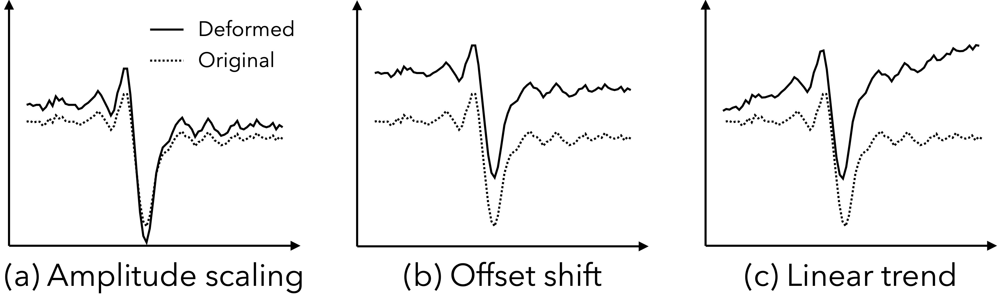
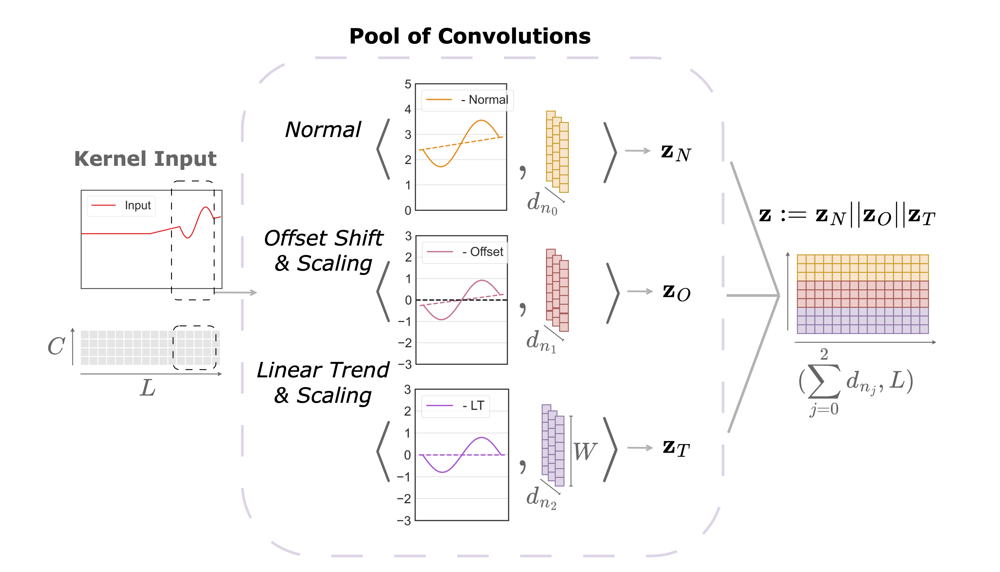
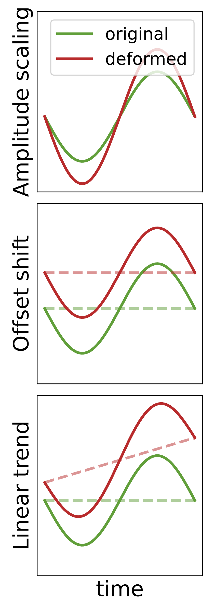

<div align="center">

# Official Implementation of the Paper "Time Series Representations with Hard-Coded Invariances"

</div>

<!--
<p align="center">
  
  <br>
  <em style="font-size:24px;"><strong>Common Time Series Deformations.</strong></em>
</p>

<p align="center">
  
  <br>
  <em style="font-size:24px;"><strong>InvConvNet (pool of different types of convolutions with concatenation).</strong></em>
</p>
-->
<table>
  <tr>
    <td align="center">
      <br>
      <em style="font-size:24px;"><strong>Common Deformations.</strong></em>
    </td>
    <td align="center">
      <br>
      <em style="font-size:24px;"><strong>InvConvNet (pool of different types of convolutions with concatenation).</strong></em>
    </td>
  </tr>
</table>

<div align="center">

## Invariant Convolutional Layers for Time Series (InvConvNet method)

</div>

This repository contains the PyTorch code for the proposed invariant convolutions presented in the paper **"Time Series Representations with Hard-Coded Invariances"**, which was accepted at **ICML 2025**. Experiments include Classification and Anomaly detection settings for univariate/multivariate time series datasets. 
Implementations are provided for the proposed **InvConvNet** (with standard and invariant convolutions) and vanilla CNN baselines (with standard convolutions), including [Inception](https://github.com/TheMrGhostman/InceptionTime-Pytorch/blob/master/inception.py), [ResNet](https://github.com/okrasolar/pytorch-timeseries/blob/master/) taken from their relevant public repositories.
Models can be found in the `./models` folder and layers in `./layers`. The scripts with the train loops for classification and anomaly detection can be found in `./exp` folder. You can test additional models and layers by following the standard format of the example code and adding the names of the models in `./exp/exp_basic.py` and their implementations in `./models`.
Similarly, the implementations of the rest baselines used in this work can be found in [Time-Series-Library](https://github.com/thuml/Time-Series-Library) official github repository.

## Usage 

### Installation
- In *python3.8*, you first need to install the required libraries:

    `pip install -r requirements.txt`

### Datasets
You can download the datasets from the following public sources and add them in the `./dataset` folder:
- **UCR** and **UEA** classification datasets can be found at https://www.timeseriesclassification.com.
- **UCIHAR**, **Sleep-EDF**, **Epilepsy** and **Fault-Diagnosis** datasets are available at the official github repo of [TS-TCC](https://github.com/emadeldeen24/TS-TCC) method.
- Anomaly detection datasets are obtained from the [Time-Series-Library](https://github.com/thuml/Time-Series-Library).

### Experiments

- **Classification experiments (InvConvNet):**

```
# UEA datasets and InvConvNet architecture
bash ./scripts/classification/train_uea_invconv.sh
# Additional class. datasets and InvConvNet architecture
bash ./scripts/classification/train_restclass_invconv.sh
```

- **Classification experiments (Vanilla CNN baselines):**

```
# UEA datasets and vanilla Inception architecture
bash ./scripts/classification/train_uea_inception.sh
# UEA datasets and vanilla ResNet architecture
bash ./scripts/classification/train_uea_resnet.sh
# UEA datasets and vanilla CNN architecture
bash ./scripts/classification/train_uea_conv.sh
# Additional class. datasets and all CNN baselines
bash ./scripts/classification/train_restclass_cnnbaselines.sh
```

- **Anomaly Detection experiments (InvConvNet):**

```
# AD datasets and vanilla InvConvNet architecture
bash ./scripts/anomaly_detection/train_anodet_invconv.sh
```

- **Anomaly Detection experiments (Vanilla CNN baselines):**

```
# AD datasets and vanilla Inception architecture
bash ./scripts/anomaly_detection/train_anodet_inception.sh
# AD datasets and vanilla ResNet architecture
bash ./scripts/anomaly_detection/train_anodet_resnet.sh
# AD datasets and vanilla CNN architecture
bash ./scripts/anomaly_detection/train_anodet_conv.sh
```

- **Robustness experiments (for Normal Conv, InvConv (offset) and InvConv (trend)):**

```
# Training for different types of convolutions 
# (--inv_ablation parameter set to 1,2,3 respectively)
bash ./scripts/robustness/train_ucr_invconv.sh
# Testing for different types of convolutions 
# and augmentation type for test set: None, Random_Off, Random_LT, Random_Off_LT, Random_Walk
bash ./scripts/robustness/test_ucr_invconv.sh
```

- **Transfer learning experiments (InvConvNet):**

```
# Training for different source datasets (--tl_source parameter set to A,B,C, or D)
# test for all remaining subdatasets
bash ./scripts/transfer_learning/train_faultd_invconv.sh
```

## Contact

- **Chrysoula Kosma:** <chrysoula.kosma@ens-paris-saclay.fr>
- **Thibaut Germain:** <thibaut.germain@ens-paris-saclay.fr>
- **Laurent Oudre:** <laurent.oudre@ens-paris-saclay.fr>

## License
The project is licensed under https://mit-license.org.

If you use our method, please cite our paper.
Here is the BibTeX file:

```bibtex
@inproceedings{tsinvconv2025,
  title     = {Time Series Representations with Hard-Coded Invariances},
  author    = {Germain, Thibaut and Kosma, Chrysoula and Oudre, Laurent},
  booktitle = {International Conference on Machine Learning},
  year      = {2025}
}

